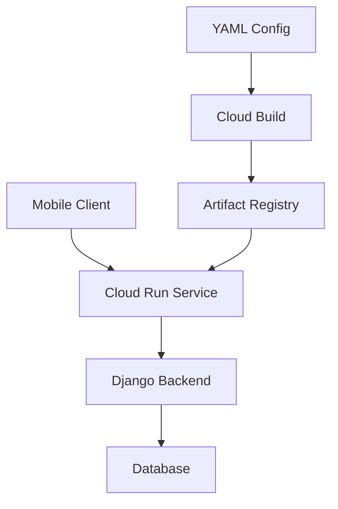

# ServiceSpin: Mobile App Backend Service

## Project Overview
ServiceSpin is a modern mobile application backend built with Django and deployed on Google Cloud Run. The service provides robust API endpoints for mobile client interactions, leveraging the power of containerization for scalable and reliable deployments.

## Tech Stack
- **Backend Framework:** Django (Python)
- **Deployment:** Google Cloud Run
- **Containerization:** Docker
- **Container Registry:** Google Artifact Registry
- **CI/CD:** Cloud Build with YAML configuration
- **Live Endpoint:** [ServiceSpin API](https://website-service-924447524543.us-central1.run.app)

## Architecture Highlights

## Key Features
- Containerized Django application for consistent deployment
- Scalable architecture using Cloud Run's serverless platform
- RESTful API endpoints for mobile client integration
- Automated deployment pipeline

## Deployment Process
1. **Containerization**
   - Django application containerized using Docker
   - Optimized container image for production deployment
   - Automated container builds via Cloud Build
   - Images stored and versioned in Artifact Registry

2. **Automated Deployment**
   - YAML configuration file for automated builds and deployments
   - Seamless integration with Google Cloud services
   - Automated testing and validation steps
   - Container versioning and rollback capabilities

3. **Cloud Deployment**
   - Deployed on Google Cloud Run for serverless operation
   - Automatic scaling based on demand
   - Zero-downtime deployments
   - Direct integration with Artifact Registry

4. **Monitoring & Maintenance**
   - Real-time performance monitoring
   - Automated health checks
   - Scalable infrastructure management

## Project Impact
- Streamlined deployment process using containerization
- Improved scalability through Cloud Run's serverless architecture
- Enhanced reliability with automated deployment pipelines
- Cost-effective infrastructure management

## Future Enhancements
- Integration with additional cloud services
- Enhanced monitoring and analytics
- Extended API capabilities for new mobile features

## Contact
For more information about this project or to discuss collaboration opportunities, please connect with me on LinkedIn.

---
*Note: This project demonstrates expertise in Django development, containerization, and cloud deployment strategies using Google Cloud Run.*
